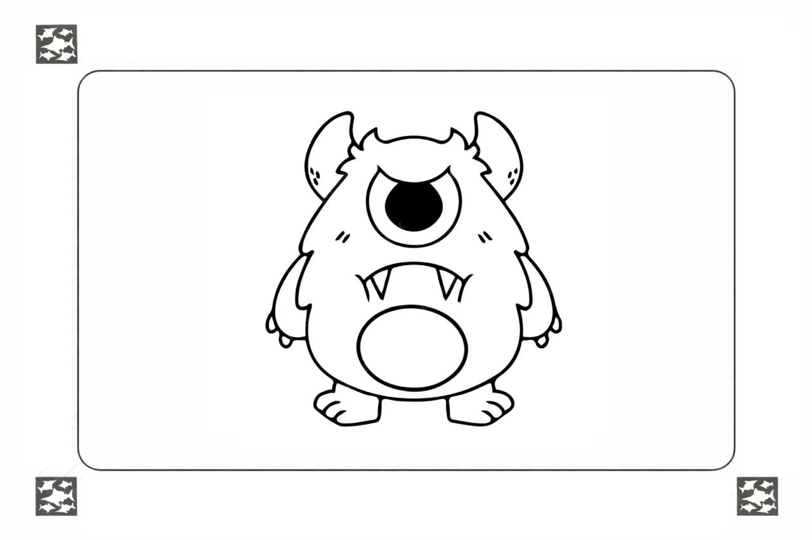
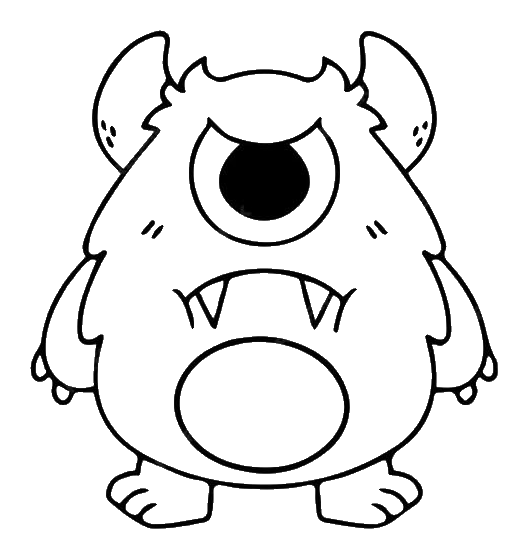
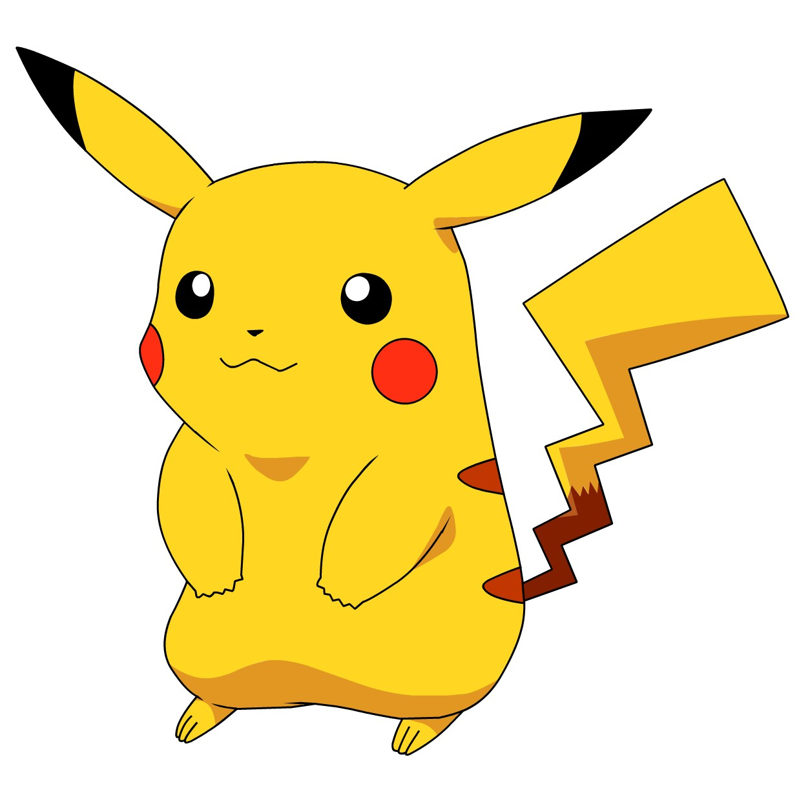
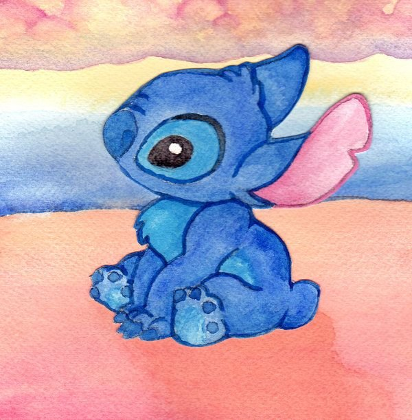
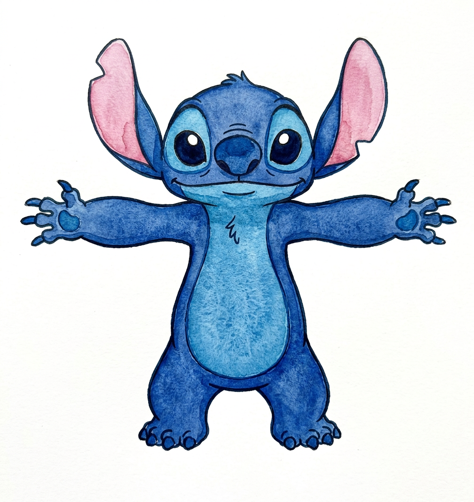
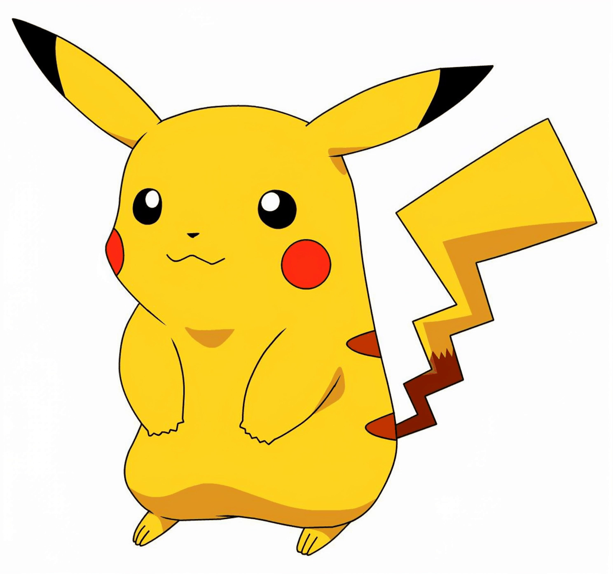
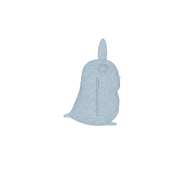

# ink-to-motion

Ребёнок рисует на бумаге → мы оцифровываем → оживляем.

### Выводы

- **Проприетарные модели через API** ([OpenRouter](https://openrouter.ai/), [fal.ai](https://fal.ai/)) дают SOTA-качество без нагрузки на локальное железо: неограниченная параллельность, нет проблем с VRAM, всегда свежие модели, pay-per-use дешевле содержания GPU при малых объёмах.
- **Предобработка — самый важный шаг.** Чем чище вход (персонаж на белом фоне, без мусора, нормализованная поза), тем лучше результат на всех следующих этапах. Мусор на входе → мусор на выходе.
- **Самый быстрый путь к результату:** предобработка (очистка фона + нормализация позы) → image-to-video с хорошим промптом. Минимум шагов, максимум эффекта.

## Пайплайн

### 1. Предобработка

> Рисунок приходит как фото/скан — с тенями, рамками, мусором по краям. Нужно извлечь только персонажа.

**Чистый фон** (скан, фото на белом) — классический CV: бинаризация, морфология, контуры.

**Сложный фон** (фото на столе, тетрадка, тени) — AI-сегментация:
- [rembg](https://github.com/danielgatis/rembg) — удаление фона, работает из коробки
- [SAM 2](https://github.com/facebookresearch/sam2) (Meta) — сегментация чего угодно, можно указать объект кликом
- [BRIA RMBG](https://huggingface.co/briaai/RMBG-2.0) — лёгкая модель для background removal

**Пример** (реализация в [`preprocess.ipynb`](preprocess.ipynb)):

| | Вход | Выход | Метод |
|---|------|-------|-------|
| Ч/б контур |  |  | CV |
| Цветной |  |  | CV |
| Сложный фон |  |  | AI (rembg) |

### 2. Улучшение рисунка (опционально)

> Детский набросок может быть бледным, низкого разрешения или слишком простым для хорошей анимации. Можно улучшить до подачи на следующие шаги.

**Апскейл** — повышение разрешения:
- [Real-ESRGAN](https://github.com/xinntao/Real-ESRGAN) — x4 апскейл, хорошо работает на рисунках/аниме
- [SwinIR](https://github.com/JingyunLiang/SwinIR) — transformer-based super resolution

**Пример апскейла** (Real-ESRGAN x4, реализация в [`preprocess.ipynb`](preprocess.ipynb)):

| До (483x511) | После (1932x2044) |
|---|---|
|  |  |

**Стилизация** — из наброска в "продакшн" картинку (img2img):
- [ControlNet](https://github.com/lllyasviel/ControlNet) + SD — линии/скетч как контроль, стиль через промпт
- [T2I-Adapter](https://github.com/TencentARC/T2I-Adapter) — аналогичный подход, легче

**Раскраска** — автоматическая раскраска ч/б рисунка:
- [Style2Paints](https://github.com/lllyasviel/style2paints) — AI-раскраска скетчей
- ControlNet lineart + цветовой промпт

**Нормализация позы** — привести персонажа в T-pose/A-pose для удобства rigging и анимации:
- [IP-Adapter](https://github.com/tencent-ailab/IP-Adapter) + ControlNet openpose — сохраняем внешность персонажа, задаём целевую позу скелетом
- [CharacterGen](https://github.com/zjp-shadow/CharacterGen) — генерация character sheet (фронт, бок, спина) из одного ракурса

**Пример нормализации позы** (реализация в [`normalize_pose.ipynb`](normalize_pose.ipynb)):

| Оригинал | Qwen-Image-Edit (локально) | Gemini 3.1 Flash (OpenRouter) |
|---|---|---|
|  |  |  |

### 3. Pose Estimation (опционально)

> Скелет нужен для управляемой анимации — чтобы персонаж двигался по заданному паттерну (танец, ходьба), а не "как модель решит". Без скелета можно обойтись (см. 4.2 без pose), но с ним результат предсказуемее.

**Автоматически** — задача специфическая, готовых решений для рисунков нет. Нужно:
- Классифицировать тип скелета (двуногий, четвероногий, водный и т.д.)
- Под каждый тип — своя модель pose estimation
- Путь: разметка данных + дообучение (YOLO-pose или аналоги)

Ссылки:
- [YOLOv8-pose](https://docs.ultralytics.com/tasks/pose/) — лёгкая модель, можно дообучить на свои keypoints
- [DWPose](https://github.com/IDEA-Research/DWPose) — SOTA pose estimation, используется в MusePose
- [RTMPose](https://github.com/open-mmlab/mmpose/tree/main/projects/rtmpose) (MMPose) — быстрый, есть animal-модели

**Вручную** — пользователь сам размечает ключевые точки скелета по шаблону.

**Пример ручной разметки** (реализация в [`pose.ipynb`](pose.ipynb)):

| Персонаж | Скелет |
|---|---|
|  |  |

### 4. Оживление

#### 4.1 Bone-анимация (без AI)

> Классический подход: разрезаем персонажа на части по скелету и вращаем вокруг суставов. Предсказуемо, быстро, работает на любом устройстве. Движения можно брать из mocap-данных (BVH-файлы).
>
> **Ограничение:** хорошо работает только на stick-figure (палочные рисунки) и контурных персонажах с тонкими конечностями. На объёмных рисунках с заливкой части разъезжаются, видны швы и артефакты — для таких лучше использовать генеративный i2v (п. 4.2).

- Требует pose estimation (шаг 3)
- Движения из mocap баз: [CMU MoCap](http://mocap.cs.cmu.edu/), [Mixamo](https://www.mixamo.com/)

**Пример** (реализация в [`animate_bone.ipynb`](animate_bone.ipynb)):

| Stick-figure (работает) | Заливка (артефакты) |
|---|---|
|  |  |

#### 4.2 Image-to-Video

> Генеративная модель оживляет рисунок целиком — самый универсальный подход, работает на любых персонажах.

**С pose estimation** — управляемая анимация через видео-референс:
- [MusePose](https://github.com/TMElyralab/MusePose) — pose-driven i2v, танец по референсу (16GB VRAM @ 512x512)
- [MagicAnimate](https://github.com/magic-research/magic-animate) — аналогичный подход от ByteDance
- [Animate Anyone](https://github.com/HumanAIGC/AnimateAnyone) — Alibaba, есть community-репродукции

**Без pose estimation** — генеративная модель сама решает как двигать:
- [Wan 2.1](https://github.com/Wan-Video/Wan2.1) — i2v от Alibaba, лёгкие и тяжёлые версии
- [CogVideoX](https://github.com/THUDM/CogVideo) — i2v от Tsinghua
- [Stable Video Diffusion](https://github.com/Stability-AI/generative-models) — i2v от Stability AI

**Пример** (реализация в [`i2v.ipynb`](i2v.ipynb)):

| Оригинал | Wan 2.1 VACE 1.3B (локально) | Kling v2.5 Turbo Pro (fal.ai) |
|---|---|---|
|  |  |  |
| | [mp4](OUTPUT/img03_i2v.mp4) | [mp4](OUTPUT/img03_i2v_kling.mp4) |

#### 4.3 Image-to-3D

> Перевод рисунка в 3D-модель — можно крутить, анимировать в движке, использовать в играх.

- [TripoSR](https://github.com/VAST-AI-Research/TripoSR) — быстрый, ~6GB VRAM, базовый меш
- [Hunyuan3D 2.1](https://github.com/Tencent-Hunyuan/Hunyuan3D-2.1) — Tencent, PBR текстуры, 10-29GB VRAM
- [Trellis-2](https://github.com/Microsoft/TRELLIS) — Microsoft, лучшее качество, 16GB+ VRAM

**Пример** (реализация в [`i2mesh.ipynb`](i2mesh.ipynb)).
Для раскраски меша по оригинальному рисунку можно использовать Hunyuan3D-Paint (21GB+ VRAM).

| Hunyuan3D-2 shape only (локально) | Trellis (fal.ai) |
|---|---|
|  |  |
| [glb](OUTPUT/img03_mesh.glb) | [glb](OUTPUT/img03_mesh_trellis.glb) |

## Инфраструктура

Каждый шаг протестирован в двух режимах — бесплатно на локальном GPU и через облачные API:

| | Локально (open-source) | Облако (SOTA) |
|---|---|---|
| **GPU** | RTX 4070 Ti SUPER 16GB | — |
| **Нормализация позы** | Qwen-Image-Edit | Gemini 3.1 Flash ([OpenRouter](https://openrouter.ai/)) |
| **Image-to-Video** | Wan 2.1 VACE 1.3B | Kling v2.5 Turbo Pro ([fal.ai](https://fal.ai/), ~$0.35/5с) |
| **Image-to-3D** | Hunyuan3D-2 | Trellis ([fal.ai](https://fal.ai/), ~$0.02) |

## Похожие проекты

- [AnimatedDrawings](https://github.com/facebookresearch/AnimatedDrawings) (Meta) — полный пайплайн от рисунка до анимации
- [Lester](https://github.com/rtous/lester-code) — анимация детских рисунков
- [Monster Mash](https://github.com/google/monster-mash) (Google) — скетч → 3D модель → анимация в браузере
