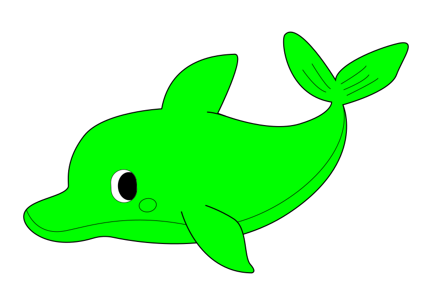
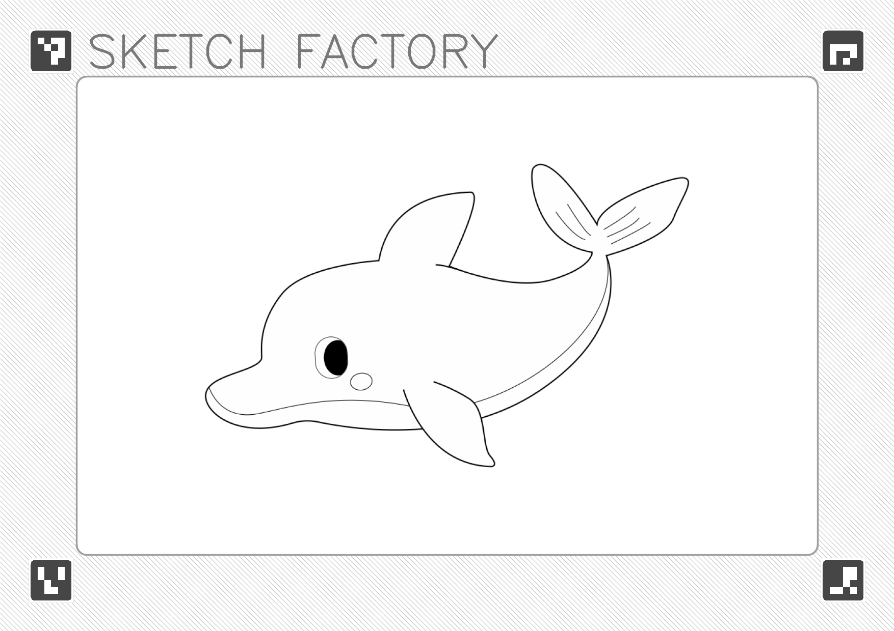
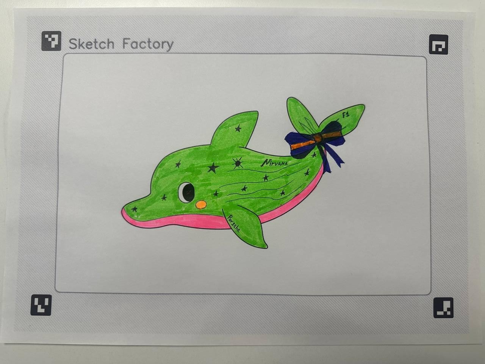
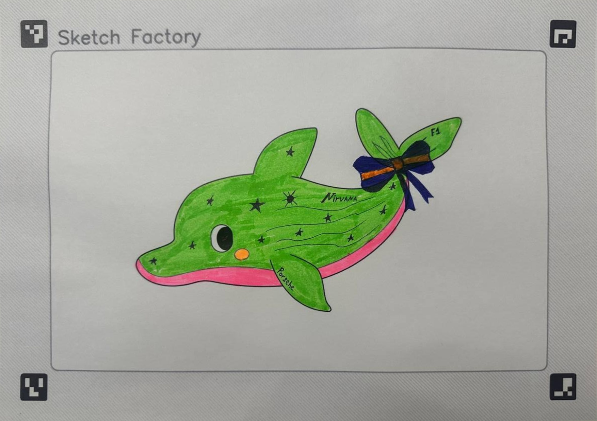
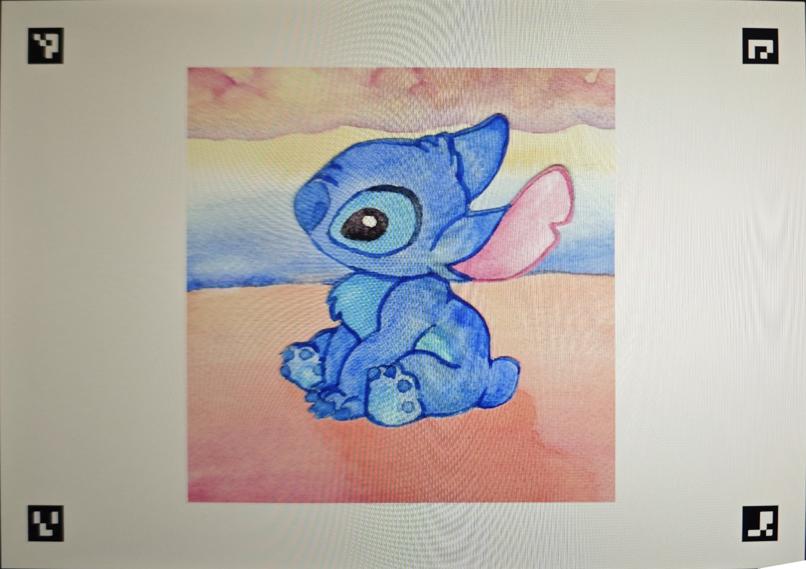
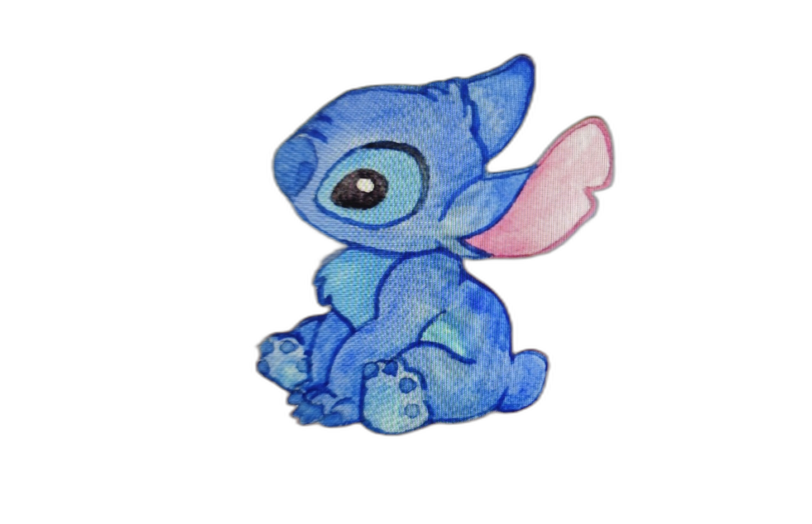

# ink-to-motion

Рисунок на бумаге → оцифровка → анимация \
DEMO: https://ink-to-motion-production.up.railway.app

## Структура проекта

| Папка | Назначение |
|---|---|
| `app/` | Продакшн — Gradio-приложение |
| `pipeline/` | Рабочий пайплайн: ноутбуки + `utils.py` (шаблоны, выравнивание, цвет, анимация) |
| `rnd/` | R&D — исследование подходов (каждый ноутбук = одна тема) |

## Требования к железу (app)

| | Минимум | Рекомендуется |
|---|---|---|
| **CPU** | любой x86-64 | 2+ ядра |
| **RAM** | 512 MB | 1 GB |
| **GPU** | не требуется | не требуется |
| **Диск** | ~200 MB | ~200 MB |

- Весь пайплайн на CPU: OpenCV, SciPy, NumPy
- GPU не используется
- rembg (u2net) — ~200 MB модель, inference на CPU

## Пайплайн

### 0. Подготовка шаблона

Всё строится от одного SVG-файла персонажа. Из него:
- генерируется шаблон для печати (A4 с ArUco-маркерами)
- извлекаются полигоны для переноса цвета (`cv2.fillPoly`)
- берутся контуры для анимации

| SVG (mask.svg) | Шаблон для печати |
|---|---|
|  |  |

### 1. Выравнивание + определение персонажа

- Фото → детекция ArUco → гомография → warp на координаты шаблона
- Персонаж определяется автоматически: 3 угловых маркера общие (TL/TR/BR), 4-й (BL) уникален для каждого персонажа

| Персонаж | Marker IDs (TL, TR, BR, **BL**) |
|---|---|
| 001 | `[0, 1, 2, 3]` |
| 002 | `[0, 1, 2, 4]` |
| 003 | `[0, 1, 2, 5]` |

> Лимит словаря `DICT_4X4_50` — 47 персонажей (50 − 3 общих маркера). Для большего числа — переключить на `DICT_4X4_100`/`DICT_4X4_250` в `app/config.py`.

| Фото | Выровненное |
|---|---|
|  |  |

### 1.1. Коррекция цвета

- Медиана цвета бумаги (поля вокруг персонажа) → поканальный gain до целевой белизны
- Компенсирует неравномерное освещение и цветовой сдвиг при съёмке

### 2. Перенос цвета

SVG path'ы → полигоны → painter's algorithm:
1. `#00FF00` (зелёный) fill → зона заливки цветом с фото (`cv2.fillPoly`)
2. `#FFFFFF` / `#000000` fill → поверх (глаз, зрачок)
3. Stroke → контуры поверх всего (`cv2.polylines`)

### 3. Анимация (mesh-деформация)

- Delaunay-триангуляция по ключевым точкам скелета
- Движение точек по синусоиде (амплитуда, частота, фаза из `motion.json`)
- Per-triangle affine warp, работает на CPU

| Триангуляция | Анимация |
|---|---|
|  |  |

### 4. Наложение на фон

- Анимация кодируется в VP9 WebM с альфа-каналом
- Персонаж накладывается на видео-фон (CSS-анимация: плавание, покачивание)
- Результат — интерактивный HTML (клик ускоряет персонажа)

## Похожие проекты

- [AnimatedDrawings](https://github.com/facebookresearch/AnimatedDrawings) (Meta) — полный пайплайн от рисунка до анимации
- [Lester](https://github.com/rtous/lester-code) — анимация детских рисунков
- [Monster Mash](https://github.com/google/monster-mash) (Google) — скетч → 3D модель → анимация в браузере

---

R&D: исследованные подходы

### Инфраструктура

| | Локально (open-source) | Облако (SOTA) |
|---|---|---|
| **GPU** | RTX 4070 Ti SUPER 16GB | — |
| **Нормализация позы** | Qwen-Image-Edit | Gemini 3.1 Flash ([OpenRouter](https://openrouter.ai/)) |
| **Image-to-Video** | Wan 2.1 VACE 1.3B | Kling v2.5 Turbo Pro ([fal.ai](https://fal.ai/), ~$0.35/5с) |
| **Image-to-3D** | Hunyuan3D-2 | Trellis ([fal.ai](https://fal.ai/), ~$0.02) |

### Улучшение рисунка (опционально)

Набросок может быть бледным или низкого разрешения. Варианты улучшения:

**Апскейл** — [Real-ESRGAN](https://github.com/xinntao/Real-ESRGAN) (x4, хорошо на рисунках), [SwinIR](https://github.com/JingyunLiang/SwinIR) (transformer-based).

| До (483x511) | После (1932x2044) |
|---|---|
|  |  |

**Стилизация** — [ControlNet](https://github.com/lllyasviel/ControlNet) + SD, [T2I-Adapter](https://github.com/TencentARC/T2I-Adapter).

**Раскраска** — [Style2Paints](https://github.com/lllyasviel/style2paints), ControlNet lineart.

**Нормализация позы** — [IP-Adapter](https://github.com/tencent-ailab/IP-Adapter) + ControlNet openpose, [CharacterGen](https://github.com/zjp-shadow/CharacterGen).

| Оригинал | Qwen-Image-Edit | Gemini 3.1 Flash |
|---|---|---|
|  |  |  |

### Pose Estimation

Скелет для управляемой анимации. Автоматически — готовых решений для рисунков нет, нужно дообучение ([YOLOv8-pose](https://docs.ultralytics.com/tasks/pose/), [DWPose](https://github.com/IDEA-Research/DWPose), [RTMPose](https://github.com/open-mmlab/mmpose/tree/main/projects/rtmpose)). Вручную — пользователь размечает keypoints.

| Персонаж | Скелет |
|---|---|
|  |  |

### Bone-анимация

Разрезаем по скелету, вращаем вокруг суставов. Предсказуемо, быстро, но артефакты на объёмных рисунках.

| Stick-figure (работает) | Заливка (артефакты) |
|---|---|
|  |  |

### Image-to-Video

Генеративные модели оживляют рисунок целиком.

**С pose** — [MusePose](https://github.com/TMElyralab/MusePose), [MagicAnimate](https://github.com/magic-research/magic-animate), [Animate Anyone](https://github.com/HumanAIGC/AnimateAnyone). \
**Без pose** — [Wan 2.1](https://github.com/Wan-Video/Wan2.1), [CogVideoX](https://github.com/THUDM/CogVideo), [Stable Video Diffusion](https://github.com/Stability-AI/generative-models).

| Оригинал | Wan 2.1 VACE 1.3B | Kling v2.5 Turbo Pro |
|---|---|---|
|  |  |  |

### Image-to-3D

[TripoSR](https://github.com/VAST-AI-Research/TripoSR), [Hunyuan3D 2.1](https://github.com/Tencent-Hunyuan/Hunyuan3D-2.1), [Trellis-2](https://github.com/Microsoft/TRELLIS).

| Hunyuan3D-2 | Trellis |
|---|---|
|  |  |

### Старый флоу (несколько персонажей)

**Флоу A — известный контур:**

| Контур | Выровненное фото | Результат |
|---|---|---|
|  |  |  |

**Флоу B — произвольный рисунок (rembg):**

| Кроп | Сегментация |
|---|---|
|  |  |

